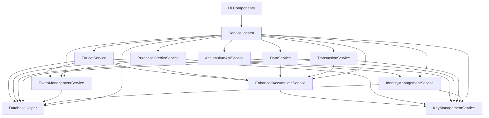

# Architecture Overview

## Project Vision

The **Accumulate Open Lite Wallet** is a complete, production-ready mobile wallet foundation built for the Accumulate blockchain protocol. This is not a demo or prototype—it's a fully functional wallet that developers can white-label, customize, and deploy immediately.

### Design Philosophy

- **Turnkey Solution**: Save 6-9 months of development by providing everything needed for a production wallet
- **Clean Architecture**: Separation of concerns with pure Dart business logic independent of Flutter UI
- **Modular Design**: Well-defined service boundaries allowing easy customization and extension
- **Developer-First**: Comprehensive documentation, clear patterns, and extensible architecture

## High-Level Architecture

```
┌─────────────────────────────────────────────────────────────┐
│                     Presentation Layer                      │
│  ┌─────────────────┐ ┌─────────────────┐ ┌─────────────────┐│
│  │   Dashboard     │ │  Transactions   │ │   Settings      ││
│  │     Screen      │ │     Screen      │ │    Screen       ││
│  └─────────────────┘ └─────────────────┘ └─────────────────┘│
└─────────────────────────────────────────────────────────────┘
                              │
┌─────────────────────────────────────────────────────────────┐
│                    Business Logic Layer                     │
│  ┌─────────────────┐ ┌─────────────────┐ ┌─────────────────┐│
│  │  Identity Mgmt  │ │  Token Services │ │ Data Services   ││
│  │   Key Mgmt      │ │  Balance Agg    │ │ Storage Layer   ││
│  │  Transaction    │ │  Credit Services│ │ Network Layer   ││
│  │   Signing       │ │  Faucet Service │ │                 ││
│  └─────────────────┘ └─────────────────┘ └─────────────────┘│
└─────────────────────────────────────────────────────────────┘
                              │
┌─────────────────────────────────────────────────────────────┐
│                     Data Layer                              │
│  ┌─────────────────┐ ┌─────────────────┐ ┌─────────────────┐│
│  │  SQLite DB      │ │  Secure Storage │ │ Accumulate API  ││
│  │  (Accounts,     │ │  (Private Keys, │ │  (DevNet/       ││
│  │   Transactions, │ │   Mnemonics,    │ │   Testnet/      ││
│  │   Preferences)  │ │   Credentials)  │ │   Mainnet)      ││
│  └─────────────────┘ └─────────────────┘ └─────────────────┘│
└─────────────────────────────────────────────────────────────┘
```

## Core Layers

### 1. Presentation Layer (`lib/main.dart`, `lib/widgets/`, `lib/shared/`)

**Purpose**: Flutter UI components and user interaction

**Components**:
- **Dashboard**: Balance overview, account management, transaction history
- **Wallets Management**: Create lite accounts, manage ADI identities, import/export
- **Transaction Flows**: Send tokens, write data, purchase credits, faucet integration
- **Multi-Signature**: Transaction signing, delegation management, governance
- **Settings**: Network configuration, security preferences, developer tools

**Key Features**:
- Material Design 3 theming system
- Responsive layouts for multiple screen sizes
- QR code scanning and generation
- Charts and data visualization (fl_chart)
- Developer bypass mode for testing

### 2. Business Logic Layer (`lib/core/`)

**Purpose**: Pure Dart business logic with no Flutter dependencies

#### Core Services (`lib/core/services/`)

**Service Locator Pattern**: Centralized dependency injection via `ServiceLocator`

**Key Services**:

1. **Identity & Key Management**
   - `KeyManagementService`: Ed25519 key generation, storage, encryption
   - `IdentityManagementService`: ADI creation, key page management
   - `TransactionSigningService`: Multi-signature transaction workflows

2. **Blockchain Integration**
   - `AccumulateApiService`: Direct API communication
   - `EnhancedAccumulateService`: High-level blockchain operations
   - `BalanceAggregationService`: Real-time balance queries and caching

3. **Token & Transaction Services**
   - `TokenManagementService`: Token account creation and management
   - `TransactionService`: Transaction building and submission
   - `CreditService`: Credit purchasing and management
   - `FaucetService`: DevNet token distribution

4. **Data & Storage Services**
   - `DataService`: Accumulate data account management
   - `DatabaseHelper`: SQLite operations and schema management
   - `WalletStorageService`: Account persistence and retrieval
   - `SecureKeysService`: Encrypted key storage via FlutterSecureStorage

#### Data Models (`lib/core/models/`)

**Purpose**: Type-safe data structures for all business entities

**Key Models**:
- `AccumulateAccount`: Unified account representation (lite, ADI, token, data)
- `AccumulateIdentity`: ADI identity with key books and pages
- `TransactionRecord`: Transaction history and status tracking
- `AccountBalance`: Balance caching and aggregation
- `PriceData`: ACME price tracking for USD conversion

#### Constants & Configuration (`lib/core/constants/`)

**AppConstants**: Network endpoints, faucet addresses, polling intervals
**NetworkType**: Environment configuration (devnet, testnet, mainnet)
**TransactionTypes**: Supported transaction types

### 3. Data Layer

#### Local Storage
- **SQLite Database**: Accounts, transactions, balances, preferences, price data
- **Secure Storage**: Private keys, mnemonics, encrypted credentials
- **Shared Preferences**: User settings and configuration

#### Network Layer
- **Accumulate API**: RESTful JSON-RPC communication
- **HTTP Client**: Configurable networking with retry logic
- **WebSocket**: Real-time transaction monitoring (prepared for future implementation)

## Service Dependencies



## Security Architecture

### Key Management
- **Ed25519 Cryptography**: Industry-standard elliptic curve signatures
- **Hierarchical Key Derivation**: BIP39 mnemonic support (ready for implementation)
- **Secure Enclave Integration**: Platform keystore utilization
- **Key Rotation**: Support for key updates and migration

### Storage Security
- **Encrypted Private Keys**: AES encryption for database storage
- **Secure Element**: Hardware-backed key storage when available
- **Biometric Authentication**: Ready for fingerprint/face unlock integration
- **Key Derivation**: PBKDF2 for password-based encryption

### Network Security
- **TLS/SSL**: All API communications encrypted
- **Certificate Pinning**: Ready for production deployment
- **Request Signing**: Transaction integrity verification
- **Rate Limiting**: DoS protection and API quota management

## State Management

### Pattern: Service Locator + Provider
- **ServiceLocator**: Dependency injection for business logic
- **Provider**: Reactive UI state management
- **StatefulWidget**: Local component state
- **FutureBuilder**: Asynchronous data loading

### Data Flow
1. **UI Action**: User interaction triggers service call
2. **Service Processing**: Business logic executed via ServiceLocator
3. **Data Persistence**: Results stored in SQLite or secure storage
4. **UI Update**: Provider/setState triggers rebuild
5. **Cache Invalidation**: Stale data refreshed as needed

## Platform Support

### Current Implementation
- **Android**: Full support with material design
- **iOS**: Ready for deployment (platform files included)
- **Target SDK**: Android 21+, iOS 12+

### Cross-Platform Considerations
- **Platform Channels**: Ready for native module integration
- **File System**: Cross-platform path handling
- **Secure Storage**: Platform-specific keychain/keystore
- **Deep Linking**: URL scheme handling prepared

## Performance Characteristics

### Optimization Strategies
- **Lazy Loading**: Services initialized on-demand
- **Request Deduplication**: Concurrent API call management
- **Balance Caching**: 30-second refresh intervals with manual override
- **Database Indexing**: Optimized queries for account and transaction lookups
- **Memory Management**: Proper disposal patterns for resources

### Scalability Considerations
- **Pagination**: Transaction history and account lists
- **Background Processing**: Non-blocking operations
- **Offline Support**: Local-first architecture with sync
- **Multi-Account**: Unlimited account support

## Integration Points

### External Services (Ready for Integration)
- **Authentication Providers**: OAuth, SAML, custom backends
- **Cloud Storage**: Account backup and multi-device sync
- **Push Notifications**: FCM/APNs for transaction alerts
- **Analytics**: Crash reporting and usage metrics
- **KYC/AML**: Identity verification services

### Blockchain Networks
- **DevNet**: Local development with accumulate-devnet-distribution
- **TestNet**: Public testing environment
- **MainNet**: Production deployment ready

## Extension Mechanisms

### Adding New Features
1. **Create Service**: Implement in `lib/core/services/`
2. **Register in ServiceLocator**: Add to dependency injection
3. **Create UI**: Add screens and widgets
4. **Update Models**: Extend data structures as needed
5. **Add Tests**: Unit and integration test coverage

### White-Label Customization
- **Theming**: Complete Material Design 3 customization
- **Branding**: Asset replacement and color schemes
- **Feature Flags**: Enable/disable functionality
- **Network Configuration**: Custom endpoints and parameters

## Testing Strategy

### Included Test Structure
- **Unit Tests**: Service logic and data models
- **Widget Tests**: UI component behavior
- **Integration Tests**: End-to-end user workflows
- **Golden Tests**: UI regression testing

### Testing Tools
- **Flutter Test**: Built-in testing framework
- **Mockito**: Service mocking and stubbing
- **Test Coverage**: Comprehensive coverage reporting
- **Device Testing**: Multiple screen sizes and platforms

## Development Workflow

### Getting Started
1. **Clone Repository**: `git clone https://github.com/opendlt/accumulate-open-lite-wallet`
2. **Setup DevNet**: Follow devnet-distribution instructions
3. **Install Dependencies**: `flutter pub get`
4. **Run Application**: `flutter run`
5. **Explore Documentation**: Review `/docs` directory

### Development Best Practices
- **Clean Architecture**: Keep business logic pure Dart
- **Dependency Injection**: Use ServiceLocator for all services
- **Error Handling**: Comprehensive try-catch with user feedback
- **Documentation**: Comment complex logic and public APIs
- **Version Control**: Feature branches with descriptive commits

## Production Readiness

### What's Included
**Complete UI**: All wallet functionality implemented
**Blockchain Integration**: Full Accumulate protocol support
**Security**: Production-grade cryptography and key management
**Performance**: Optimized for mobile devices
**Documentation**: Comprehensive guides and references
**Testing**: Unit and integration test coverage
**Platform Support**: Android and iOS ready

### What You Need to Add
**Authentication**: User registration and login system
**Backend Integration**: Optional cloud services
**Push Notifications**: Real-time alerts
**App Store Assets**: Screenshots, descriptions, metadata
**Production Configuration**: API keys, certificates, endpoints

### Deployment Considerations
- **Code Signing**: Platform-specific certificates required
- **API Configuration**: Production endpoint configuration
- **Security Review**: Penetration testing recommended
- **Performance Testing**: Load testing with real users
- **Compliance**: Regulatory requirements (KYC/AML as needed)

## Future Roadmap

### Planned Enhancements
- **Multi-Signature UI**: Enhanced delegation management
- **DeFi Integration**: DEX and lending protocol support
- **NFT Support**: Accumulate NFT standard implementation
- **Governance Tools**: Voting and proposal management
- **Advanced Analytics**: Portfolio tracking and insights

### Extension Opportunities
- **Plugin Architecture**: Third-party module support
- **Custom Tokens**: Support for additional token standards
- **Cross-Chain**: Bridge integration with other blockchains
- **Enterprise Features**: Multi-user and role-based access
- **Hardware Wallets**: Ledger and Trezor integration

---

This architecture provides a solid foundation for building production-grade Accumulate wallet applications while maintaining flexibility for customization and extension.