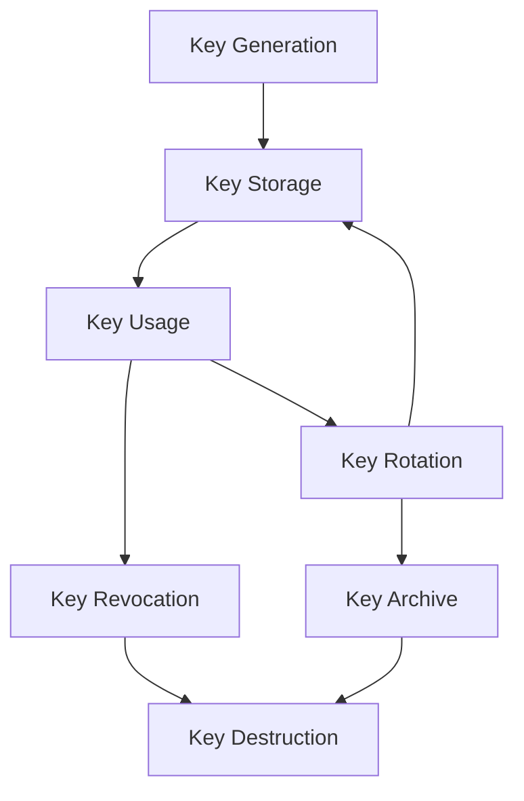

# Security Documentation

This document provides comprehensive security information for the Accumulate Open Lite Wallet, including cryptographic implementations, threat models, security best practices, and audit guidance.

## Table of Contents

- [Security Overview](#security-overview)
- [Cryptographic Implementation](#cryptographic-implementation)
- [Key Management](#key-management)
- [Storage Security](#storage-security)
- [Network Security](#network-security)
- [Transaction Security](#transaction-security)
- [Threat Model](#threat-model)
- [Security Best Practices](#security-best-practices)
- [Audit Guidelines](#audit-guidelines)
- [Incident Response](#incident-response)

## Security Overview

### Security Principles

The Accumulate Open Lite Wallet follows industry-standard security principles:

1. **Defense in Depth**: Multiple layers of security controls
2. **Least Privilege**: Minimal access rights for operations
3. **Fail Secure**: Default to secure state on errors
4. **Security by Design**: Built-in security from the ground up
5. **Transparency**: Open-source for security review

### Security Architecture

```
┌─────────────────────────────────────────────────────────────┐
│                    Application Layer                        │
│  ┌─────────────────┐ ┌─────────────────┐ ┌─────────────────┐│
│  │  Input Validation│ │  Authentication │ │  Authorization  ││
│  │     & Sanitization│ │    & Session    │ │   & Access      ││
│  │                 │ │   Management    │ │   Control       ││
│  └─────────────────┘ └─────────────────┘ └─────────────────┘│
└─────────────────────────────────────────────────────────────┘
                              │
┌─────────────────────────────────────────────────────────────┐
│                 Cryptographic Layer                         │
│  ┌─────────────────┐ ┌─────────────────┐ ┌─────────────────┐│
│  │   Ed25519       │ │   PBKDF2        │ │    AES-256      ││
│  │   Digital       │ │   Key           │ │   Encryption    ││
│  │   Signatures    │ │   Derivation    │ │                 ││
│  └─────────────────┘ └─────────────────┘ └─────────────────┘│
└─────────────────────────────────────────────────────────────┘
                              │
┌─────────────────────────────────────────────────────────────┐
│                   Storage Layer                             │
│  ┌─────────────────┐ ┌─────────────────┐ ┌─────────────────┐│
│  │  Secure Keychain│ │  Encrypted      │ │   Database      ││
│  │  (iOS Keychain/ │ │  Private Keys   │ │   Encryption    ││
│  │  Android Keystore│ │                 │ │                 ││
│  └─────────────────┘ └─────────────────┘ └─────────────────┘│
└─────────────────────────────────────────────────────────────┘
                              │
┌─────────────────────────────────────────────────────────────┐
│                   Network Layer                             │
│  ┌─────────────────┐ ┌─────────────────┐ ┌─────────────────┐│
│  │   TLS 1.3       │ │  Certificate    │ │   Request       ││
│  │   Encryption    │ │   Pinning       │ │   Signing       ││
│  │                 │ │                 │ │                 ││
│  └─────────────────┘ └─────────────────┘ └─────────────────┘│
└─────────────────────────────────────────────────────────────┘
```

### Compliance Standards

The wallet implements security controls aligned with:

- **NIST Cybersecurity Framework**
- **OWASP Mobile Security Guidelines**
- **Common Criteria for Mobile Applications**
- **ISO 27001/27002 Security Controls**
- **Financial Industry Standards (where applicable)**

## Cryptographic Implementation

### Digital Signatures

**Algorithm**: Ed25519 (Edwards-curve Digital Signature Algorithm)

**Implementation Details**:
```dart
// Key generation
final keyPair = Ed25519KeypairSigner.generate();
final publicKey = keyPair.publicKey();      // 32 bytes
final privateKey = keyPair.secretKey();     // 32 bytes
final publicKeyHash = keyPair.publicKeyHash(); // 32 bytes (SHA-256)

// Signature generation
final message = utf8.encode("transaction data");
final signature = keyPair.signRaw(message); // 64 bytes

// Signature verification
final isValid = keyPair.verifySignature(message, signature);
```

**Security Properties**:
- **128-bit security level** (equivalent to 3072-bit RSA)
- **Deterministic signatures** (no nonce reuse vulnerabilities)
- **Small signature size** (64 bytes)
- **Fast verification** (~70,000 verifications/second)
- **Side-channel resistance** (constant-time implementation)

### Key Derivation

**Algorithm**: PBKDF2 with SHA-256

**Implementation**:
```dart
class KeyDerivation {
  static Uint8List deriveKey({
    required String password,
    required Uint8List salt,
    int iterations = 100000,
    int keyLength = 32,
  }) {
    final pbkdf2 = Pbkdf2(
      macAlgorithm: Hmac.sha256(),
      iterations: iterations,
      bits: keyLength * 8,
    );

    final secretKey = pbkdf2.deriveKey(
      secretKey: SecretKey(utf8.encode(password)),
      nonce: salt,
    );

    return Uint8List.fromList(secretKey.extractSync());
  }

  static Uint8List generateSalt() {
    final random = Random.secure();
    return Uint8List.fromList(
      List.generate(32, (_) => random.nextInt(256)),
    );
  }
}
```

**Parameters**:
- **Hash Function**: SHA-256
- **Iterations**: 100,000 (OWASP recommended minimum)
- **Salt Length**: 32 bytes (256 bits)
- **Output Length**: 32 bytes (256 bits)

### Symmetric Encryption

**Algorithm**: AES-256-GCM

**Implementation**:
```dart
class AESEncryption {
  static Future<EncryptionResult> encrypt({
    required Uint8List plaintext,
    required Uint8List key,
  }) async {
    final algorithm = AesGcm.with256bits();
    final secretKey = SecretKey(key);

    // Generate random nonce
    final nonce = algorithm.newNonce();

    // Encrypt with authentication
    final secretBox = await algorithm.encrypt(
      plaintext,
      secretKey: secretKey,
      nonce: nonce,
    );

    return EncryptionResult(
      ciphertext: Uint8List.fromList(secretBox.cipherText),
      nonce: nonce,
      tag: Uint8List.fromList(secretBox.mac.bytes),
    );
  }

  static Future<Uint8List> decrypt({
    required EncryptionResult encryptionResult,
    required Uint8List key,
  }) async {
    final algorithm = AesGcm.with256bits();
    final secretKey = SecretKey(key);

    final secretBox = SecretBox(
      encryptionResult.ciphertext,
      nonce: encryptionResult.nonce,
      mac: Mac(encryptionResult.tag),
    );

    final plaintext = await algorithm.decrypt(
      secretBox,
      secretKey: secretKey,
    );

    return Uint8List.fromList(plaintext);
  }
}
```

**Security Properties**:
- **256-bit key size** (post-quantum resistant)
- **Authenticated encryption** (prevents tampering)
- **Unique nonces** (prevents replay attacks)
- **Constant-time operations** (side-channel resistant)

### Random Number Generation

**Implementation**:
```dart
class SecureRandom {
  static final Random _secureRandom = Random.secure();

  static Uint8List generateBytes(int length) {
    return Uint8List.fromList(
      List.generate(length, (_) => _secureRandom.nextInt(256)),
    );
  }

  static String generateHex(int length) {
    final bytes = generateBytes(length);
    return bytes.map((byte) => byte.toRadixString(16).padLeft(2, '0')).join();
  }

  static BigInt generateBigInt(int bitLength) {
    final byteLength = (bitLength + 7) ~/ 8;
    final bytes = generateBytes(byteLength);

    // Clear excess bits
    if (bitLength % 8 != 0) {
      final excessBits = 8 - (bitLength % 8);
      bytes[0] = bytes[0] >> excessBits;
    }

    return BigInt.parse(
      bytes.map((byte) => byte.toRadixString(16).padLeft(2, '0')).join(),
      radix: 16,
    );
  }
}
```

**Security Properties**:
- **Cryptographically secure** pseudorandom number generator
- **Platform entropy sources** (OS-provided randomness)
- **Sufficient entropy** for cryptographic operations

## Key Management

### Key Lifecycle



### Key Generation

**Process**:
1. **Entropy Collection**: Gather entropy from OS sources
2. **Seed Generation**: Create cryptographically secure seed
3. **Key Derivation**: Generate key pair using Ed25519
4. **Key Validation**: Verify key mathematical properties
5. **Secure Storage**: Store private key in secure storage

**Implementation**:
```dart
Future<KeyPairData> generateSecureKeyPair() async {
  // Generate key pair
  final keyPair = Ed25519KeypairSigner.generate();

  // Extract key components
  final publicKey = keyPair.publicKey();
  final privateKey = keyPair.secretKey();
  final publicKeyHash = keyPair.publicKeyHash();

  // Validate key generation
  assert(publicKey.length == 32, 'Invalid public key length');
  assert(privateKey.length == 32, 'Invalid private key length');
  assert(publicKeyHash.length == 32, 'Invalid public key hash length');

  // Test key functionality
  final testMessage = SecureRandom.generateBytes(32);
  final signature = keyPair.signRaw(testMessage);
  final isValid = keyPair.verifySignature(testMessage, signature);
  assert(isValid, 'Generated key pair failed validation');

  return KeyPairData(
    publicKey: _bytesToHex(publicKey),
    privateKey: _bytesToHex(privateKey),
    publicKeyHash: _bytesToHex(publicKeyHash),
  );
}
```

### Key Storage

#### Secure Storage Architecture

```dart
abstract class SecureStorage {
  Future<void> write(String key, String value);
  Future<String?> read(String key);
  Future<void> delete(String key);
  Future<void> deleteAll();
  Future<bool> containsKey(String key);
}

class PlatformSecureStorage implements SecureStorage {
  final FlutterSecureStorage _storage;

  PlatformSecureStorage() : _storage = const FlutterSecureStorage(
    aOptions: AndroidOptions(
      encryptedSharedPreferences: true,
      sharedPreferencesName: 'accumulate_secure_storage',
      preferencesKeyPrefix: 'acc_',
    ),
    iOptions: IOSOptions(
      groupId: 'group.com.yourcompany.accumulate',
      accessibility: IOSAccessibility.first_unlock_this_device,
    ),
  );

  @override
  Future<void> write(String key, String value) async {
    await _storage.write(key: key, value: value);
  }

  @override
  Future<String?> read(String key) async {
    return await _storage.read(key: key);
  }
}
```

#### Private Key Encryption

```dart
class EncryptedKeyStorage {
  final SecureStorage _secureStorage;
  final String _masterKeyId = 'master_encryption_key';

  Future<void> storePrivateKey({
    required String keyId,
    required String privateKeyHex,
    required String passphrase,
  }) async {
    // Derive encryption key from passphrase
    final salt = SecureRandom.generateBytes(32);
    final encryptionKey = KeyDerivation.deriveKey(
      password: passphrase,
      salt: salt,
      iterations: 100000,
    );

    // Encrypt private key
    final privateKeyBytes = _hexToBytes(privateKeyHex);
    final encryptionResult = await AESEncryption.encrypt(
      plaintext: privateKeyBytes,
      key: encryptionKey,
    );

    // Store encrypted data
    final encryptedData = {
      'salt': base64Encode(salt),
      'nonce': base64Encode(encryptionResult.nonce),
      'ciphertext': base64Encode(encryptionResult.ciphertext),
      'tag': base64Encode(encryptionResult.tag),
      'algorithm': 'AES-256-GCM',
      'kdf': 'PBKDF2-SHA256',
      'iterations': 100000,
    };

    await _secureStorage.write(
      keyId,
      json.encode(encryptedData),
    );
  }

  Future<String?> retrievePrivateKey({
    required String keyId,
    required String passphrase,
  }) async {
    try {
      final encryptedDataJson = await _secureStorage.read(keyId);
      if (encryptedDataJson == null) return null;

      final encryptedData = json.decode(encryptedDataJson);

      // Derive decryption key
      final salt = base64Decode(encryptedData['salt']);
      final decryptionKey = KeyDerivation.deriveKey(
        password: passphrase,
        salt: salt,
        iterations: encryptedData['iterations'],
      );

      // Decrypt private key
      final encryptionResult = EncryptionResult(
        ciphertext: base64Decode(encryptedData['ciphertext']),
        nonce: base64Decode(encryptedData['nonce']),
        tag: base64Decode(encryptedData['tag']),
      );

      final privateKeyBytes = await AESEncryption.decrypt(
        encryptionResult: encryptionResult,
        key: decryptionKey,
      );

      return _bytesToHex(privateKeyBytes);
    } catch (e) {
      // Log security event
      _logSecurityEvent('Failed private key decryption', {
        'keyId': keyId,
        'error': e.toString(),
      });
      return null;
    }
  }
}
```

### Key Rotation

**Implementation**:
```dart
class KeyRotationService {
  final KeyManagementService _keyService;
  final TransactionService _transactionService;

  Future<KeyRotationResult> rotateAccountKey({
    required String accountUrl,
    required String oldKeyPageUrl,
    required String newPublicKey,
    required String signerKeyPageUrl,
  }) async {
    try {
      // Generate update key transaction
      final updateKeyTx = UpdateKeyTransaction(
        principal: accountUrl,
        oldKey: oldKeyPageUrl,
        newKey: newPublicKey,
        operation: 'replace',
      );

      // Sign with current key
      final signer = await _keyService.createADISigner(signerKeyPageUrl);
      if (signer == null) {
        return KeyRotationResult.error('Failed to create signer');
      }

      final signedTx = await updateKeyTx.sign(signer);

      // Submit transaction
      final result = await _transactionService.submitTransaction(signedTx);

      if (result.success) {
        // Archive old key
        await _archiveOldKey(oldKeyPageUrl);

        // Store new key
        await _keyService.storePrivateKey(
          accountUrl,
          newPublicKey,
        );

        return KeyRotationResult.success(result.transactionHash!);
      } else {
        return KeyRotationResult.error(result.error!);
      }
    } catch (e) {
      return KeyRotationResult.error('Key rotation failed: $e');
    }
  }
}
```

## Storage Security

### Database Encryption

**SQLite Encryption**:
```dart
class EncryptedDatabase {
  static const String _dbPassword = 'PRAGMA key = "x\'%s\'"';
  Database? _database;

  Future<Database> get database async {
    if (_database != null) return _database!;

    // Get or generate database encryption key
    final encryptionKey = await _getDatabaseEncryptionKey();

    // Open encrypted database
    _database = await openDatabase(
      await _getDatabasePath(),
      version: _databaseVersion,
      onCreate: _onCreate,
      onUpgrade: _onUpgrade,
      onOpen: (db) async {
        // Set encryption key
        await db.rawExecute(sprintf(_dbPassword, [encryptionKey]));
      },
    );

    return _database!;
  }

  Future<String> _getDatabaseEncryptionKey() async {
    const keyId = 'database_encryption_key';

    // Try to get existing key
    String? key = await _secureStorage.read(keyId);

    if (key == null) {
      // Generate new key
      key = SecureRandom.generateHex(32);
      await _secureStorage.write(keyId, key);
    }

    return key;
  }
}
```

### Data Classification

```dart
enum DataClassification {
  public,        // Non-sensitive data (account names, transaction types)
  internal,      // Internal application data (preferences, cache)
  confidential,  // Sensitive data (balances, transaction details)
  restricted,    // Highly sensitive data (private keys, mnemonics)
}

class DataProtectionService {
  static const Map<DataClassification, EncryptionLevel> _encryptionRequirements = {
    DataClassification.public: EncryptionLevel.none,
    DataClassification.internal: EncryptionLevel.basic,
    DataClassification.confidential: EncryptionLevel.standard,
    DataClassification.restricted: EncryptionLevel.high,
  };

  Future<void> storeData({
    required String key,
    required dynamic data,
    required DataClassification classification,
  }) async {
    final encryptionLevel = _encryptionRequirements[classification]!;

    switch (encryptionLevel) {
      case EncryptionLevel.none:
        await _regularStorage.write(key, data);
        break;
      case EncryptionLevel.basic:
        await _encryptedStorage.write(key, data);
        break;
      case EncryptionLevel.standard:
        await _strongEncryptedStorage.write(key, data);
        break;
      case EncryptionLevel.high:
        await _secureKeyStorage.write(key, data);
        break;
    }
  }
}
```

## Network Security

### TLS Configuration

**Implementation**:
```dart
class SecureHttpClient {
  late http.Client _client;

  SecureHttpClient() {
    _client = http.Client();
  }

  Future<http.Response> post(
    String url,
    Map<String, dynamic> body, {
    Map<String, String>? headers,
  }) async {
    // Validate URL
    final uri = Uri.parse(url);
    if (!uri.isScheme('HTTPS')) {
      throw SecurityException('Only HTTPS connections allowed');
    }

    // Add security headers
    final secureHeaders = {
      'Content-Type': 'application/json',
      'User-Agent': 'AccumulateWallet/1.0.0',
      'X-Requested-With': 'XMLHttpRequest',
      ...?headers,
    };

    try {
      final response = await _client.post(
        uri,
        headers: secureHeaders,
        body: json.encode(body),
      ).timeout(const Duration(seconds: 30));

      // Validate response
      _validateResponse(response);

      return response;
    } on TimeoutException {
      throw NetworkException('Request timeout');
    } catch (e) {
      throw NetworkException('Network error: $e');
    }
  }

  void _validateResponse(http.Response response) {
    // Check for suspicious redirects
    if (response.isRedirect) {
      throw SecurityException('Unexpected redirect detected');
    }

    // Validate content type
    final contentType = response.headers['content-type'];
    if (contentType == null || !contentType.contains('application/json')) {
      throw SecurityException('Invalid response content type');
    }
  }
}
```

### Certificate Pinning

**Implementation**:
```dart
class CertificatePinningService {
  static const Map<String, List<String>> _pinnedCertificates = {
    'api.accumulate.io': [
      'sha256/AAAAAAAAAAAAAAAAAAAAAAAAAAAAAAAAAAAAAAAAAAA=', // Primary cert
      'sha256/BBBBBBBBBBBBBBBBBBBBBBBBBBBBBBBBBBBBBBBBBBB=', // Backup cert
    ],
  };

  bool validateCertificate(String host, X509Certificate certificate) {
    final pinnedHashes = _pinnedCertificates[host];
    if (pinnedHashes == null) return true; // No pinning configured

    final certificateHash = _calculateCertificateHash(certificate);
    return pinnedHashes.contains(certificateHash);
  }

  String _calculateCertificateHash(X509Certificate certificate) {
    final publicKeyBytes = certificate.publicKey.bytes;
    final hash = sha256.convert(publicKeyBytes);
    return 'sha256/${base64Encode(hash.bytes)}';
  }
}

// HTTP client with certificate pinning
class PinnedHttpClient extends http.BaseClient {
  final http.Client _inner = http.Client();
  final CertificatePinningService _pinningService = CertificatePinningService();

  @override
  Future<http.StreamedResponse> send(http.BaseRequest request) async {
    // Implement certificate validation during TLS handshake
    // This requires platform-specific implementation
    return _inner.send(request);
  }
}
```

### Request Signing

**Implementation**:
```dart
class RequestSigner {
  final KeyManagementService _keyService;

  Future<Map<String, String>> signRequest({
    required String method,
    required String url,
    required Map<String, dynamic> body,
    required String signerKeyPageUrl,
  }) async {
    // Create canonical request string
    final canonicalRequest = _createCanonicalRequest(method, url, body);

    // Sign request
    final signer = await _keyService.createADISigner(signerKeyPageUrl);
    if (signer == null) {
      throw SecurityException('Failed to create request signer');
    }

    final signature = signer.signRaw(utf8.encode(canonicalRequest));

    // Create authorization header
    final authHeader = 'Accumulate-HMAC-SHA256 '
        'KeyId=$signerKeyPageUrl,'
        'Signature=${base64Encode(signature)},'
        'Timestamp=${DateTime.now().millisecondsSinceEpoch}';

    return {
      'Authorization': authHeader,
      'X-Accumulate-Signature': base64Encode(signature),
    };
  }

  String _createCanonicalRequest(
    String method,
    String url,
    Map<String, dynamic> body,
  ) {
    final uri = Uri.parse(url);
    final sortedParams = Map.fromEntries(
      uri.queryParameters.entries.toList()
        ..sort((a, b) => a.key.compareTo(b.key)),
    );

    final canonicalQuery = sortedParams.entries
        .map((entry) => '${entry.key}=${entry.value}')
        .join('&');

    final bodyHash = sha256.convert(utf8.encode(json.encode(body)));

    return [
      method.toUpperCase(),
      uri.path,
      canonicalQuery,
      base64Encode(bodyHash.bytes),
    ].join('\n');
  }
}
```

## Transaction Security

### Transaction Validation

**Implementation**:
```dart
class TransactionValidator {
  Future<ValidationResult> validateTransaction(Transaction transaction) async {
    final errors = <String>[];

    // Validate transaction structure
    if (!_validateTransactionStructure(transaction)) {
      errors.add('Invalid transaction structure');
    }

    // Validate signatures
    if (!await _validateSignatures(transaction)) {
      errors.add('Invalid transaction signatures');
    }

    // Validate amounts
    if (!_validateAmounts(transaction)) {
      errors.add('Invalid transaction amounts');
    }

    // Validate addresses
    if (!_validateAddresses(transaction)) {
      errors.add('Invalid account addresses');
    }

    // Check for double spending
    if (await _checkDoubleSpending(transaction)) {
      errors.add('Potential double spending detected');
    }

    return ValidationResult(
      isValid: errors.isEmpty,
      errors: errors,
    );
  }

  bool _validateTransactionStructure(Transaction transaction) {
    // Check required fields
    if (transaction.header.principal.isEmpty) return false;
    if (transaction.body == null) return false;
    if (transaction.header.nonce == null) return false;

    return true;
  }

  Future<bool> _validateSignatures(Transaction transaction) async {
    try {
      for (final signature in transaction.signatures) {
        final signer = await _getSignerForKeyPage(signature.keyPageUrl);
        if (signer == null) return false;

        final isValid = signer.verifySignature(
          transaction.getSignatureData(),
          signature.signature,
        );

        if (!isValid) return false;
      }
      return true;
    } catch (e) {
      return false;
    }
  }

  bool _validateAmounts(Transaction transaction) {
    if (transaction is SendTokensTransaction) {
      // Check for negative amounts
      if (transaction.amount <= 0) return false;

      // Check for overflow
      if (transaction.amount > double.maxFinite) return false;

      // Validate precision (max 8 decimal places for ACME)
      final amountStr = transaction.amount.toStringAsFixed(8);
      if (double.parse(amountStr) != transaction.amount) return false;
    }

    return true;
  }
}
```

### Multi-Signature Security

**Implementation**:
```dart
class MultiSignatureValidator {
  Future<MultiSigValidationResult> validateMultiSigTransaction({
    required String transactionHash,
    required List<TransactionSignature> signatures,
    required MultiSigPolicy policy,
  }) async {
    // Validate signature count
    if (signatures.length < policy.threshold) {
      return MultiSigValidationResult.error(
        'Insufficient signatures: ${signatures.length}/${policy.threshold}',
      );
    }

    // Validate signer authorization
    final authorizedSigners = <String>[];
    for (final signature in signatures) {
      if (policy.authorizedSigners.contains(signature.keyPageUrl)) {
        authorizedSigners.add(signature.keyPageUrl);
      } else {
        return MultiSigValidationResult.error(
          'Unauthorized signer: ${signature.keyPageUrl}',
        );
      }
    }

    // Check for duplicate signers
    if (authorizedSigners.length != authorizedSigners.toSet().length) {
      return MultiSigValidationResult.error('Duplicate signers detected');
    }

    // Validate signature order (if required)
    if (policy.requiresOrder && !_validateSignatureOrder(signatures, policy)) {
      return MultiSigValidationResult.error('Invalid signature order');
    }

    // Validate time constraints
    if (policy.timeLimit != null) {
      final elapsed = DateTime.now().difference(signatures.first.timestamp);
      if (elapsed > policy.timeLimit!) {
        return MultiSigValidationResult.error('Signature time limit exceeded');
      }
    }

    return MultiSigValidationResult.success();
  }
}
```

## Threat Model

### Identified Threats

#### 1. Private Key Compromise

**Threat**: Attacker gains access to private keys
**Impact**: Complete account control
**Likelihood**: Medium
**Mitigation**:
- Hardware security module integration
- Biometric authentication
- Key rotation policies
- Secure key storage

#### 2. Man-in-the-Middle Attacks

**Threat**: Network traffic interception
**Impact**: Transaction manipulation
**Likelihood**: Low (with TLS)
**Mitigation**:
- Certificate pinning
- Request signing
- TLS 1.3 enforcement
- Network monitoring

#### 3. Device Compromise

**Threat**: Malware on user device
**Impact**: Key theft, transaction monitoring
**Likelihood**: Medium
**Mitigation**:
- App-level encryption
- Runtime application self-protection
- Code obfuscation
- Anti-tampering measures

#### 4. Social Engineering

**Threat**: User manipulation
**Impact**: Unauthorized transactions
**Likelihood**: High
**Mitigation**:
- User education
- Transaction confirmation UI
- Rate limiting
- Anomaly detection

#### 5. Side-Channel Attacks

**Threat**: Information leakage through timing/power
**Impact**: Key recovery
**Likelihood**: Low
**Mitigation**:
- Constant-time operations
- Secure hardware usage
- Code reviews
- Security testing

### Risk Assessment Matrix

| Threat Category | Likelihood | Impact | Risk Level | Priority |
|----------------|------------|---------|------------|----------|
| Key Compromise | Medium | Critical | High | 1 |
| Network Attack | Low | High | Medium | 3 |
| Device Compromise | Medium | High | High | 2 |
| Social Engineering | High | Medium | High | 2 |
| Side Channel | Low | Medium | Low | 4 |

### Attack Scenarios

#### Scenario 1: Compromised Mobile Device

**Attack Vector**: Malware installation
**Attack Steps**:
1. User installs malicious app
2. Malware gains root/admin access
3. Attacker extracts app data
4. Private keys recovered from storage

**Defenses**:
- Secure storage APIs
- Runtime monitoring
- Anti-tampering measures
- Regular security updates

#### Scenario 2: Phishing Attack

**Attack Vector**: Fake wallet application
**Attack Steps**:
1. Attacker creates convincing fake app
2. User downloads and enters credentials
3. Attacker harvests private keys
4. Funds transferred to attacker accounts

**Defenses**:
- App store verification
- Digital signatures
- User education
- Official communication channels

## Security Best Practices

### Development Security

#### Secure Coding Practices

```dart
class SecureCodingPractices {
  // 1. Input validation
  static bool validateAddress(String address) {
    // Validate format
    if (!RegExp(r'^acc://[a-fA-F0-9]{64}(/.*)?$').hasMatch(address)) {
      return false;
    }

    // Validate length constraints
    if (address.length > 200) return false;

    // Additional validation logic
    return true;
  }

  // 2. Error handling
  static Future<Result<T>> safeOperation<T>(Future<T> Function() operation) async {
    try {
      final result = await operation();
      return Result.success(result);
    } catch (e) {
      // Log error securely (no sensitive data)
      _logSecurityEvent('Operation failed', {
        'operation': operation.toString(),
        'error_type': e.runtimeType.toString(),
        // Do not log sensitive details
      });
      return Result.error('Operation failed');
    }
  }

  // 3. Secure random generation
  static String generateSecureToken() {
    return SecureRandom.generateHex(32);
  }

  // 4. Time-constant comparison
  static bool constantTimeEquals(List<int> a, List<int> b) {
    if (a.length != b.length) return false;

    int result = 0;
    for (int i = 0; i < a.length; i++) {
      result |= a[i] ^ b[i];
    }
    return result == 0;
  }
}
```

### Deployment Security

#### Production Configuration

```dart
class ProductionSecurity {
  static void configureForProduction() {
    // Disable debug features
    assert(() {
      throw StateError('Debug features must be disabled in production');
    }());

    // Configure certificate pinning
    CertificatePinningService.enablePinning();

    // Enable additional security measures
    SecurityMonitor.enable();
    AntiTamperingService.enable();
    CodeObfuscation.enable();
  }

  static void validateProductionBuild() {
    // Check for debug symbols
    if (kDebugMode) {
      throw StateError('Production build cannot include debug mode');
    }

    // Validate code signing
    if (!CodeSigningValidator.isValid()) {
      throw StateError('Invalid code signature');
    }

    // Check for security flags
    if (!SecurityFlags.allEnabled()) {
      throw StateError('Security flags not properly configured');
    }
  }
}
```

### User Security

#### Security Education

```dart
class SecurityEducation {
  static List<SecurityTip> getSecurityTips() {
    return [
      SecurityTip(
        title: 'Protect Your Private Keys',
        description: 'Never share your private keys or mnemonic phrases with anyone.',
        importance: SecurityImportance.critical,
      ),
      SecurityTip(
        title: 'Verify Transactions',
        description: 'Always verify transaction details before signing.',
        importance: SecurityImportance.high,
      ),
      SecurityTip(
        title: 'Use Secure Networks',
        description: 'Avoid using public Wi-Fi for wallet operations.',
        importance: SecurityImportance.medium,
      ),
      SecurityTip(
        title: 'Keep Apps Updated',
        description: 'Install security updates promptly.',
        importance: SecurityImportance.high,
      ),
    ];
  }
}
```

## Audit Guidelines

### Security Audit Checklist

#### Cryptographic Implementation
- [ ] Ed25519 implementation follows RFC 8032
- [ ] Key generation uses secure random sources
- [ ] Private keys are never logged or exposed
- [ ] Constant-time operations for sensitive computations
- [ ] Proper key derivation parameters (PBKDF2 iterations)

#### Storage Security
- [ ] Private keys encrypted at rest
- [ ] Secure storage APIs properly configured
- [ ] Database encryption enabled
- [ ] No sensitive data in regular storage
- [ ] Proper key lifecycle management

#### Network Security
- [ ] TLS 1.3 enforced
- [ ] Certificate pinning implemented
- [ ] Request signing in place
- [ ] No sensitive data in URLs
- [ ] Proper timeout configurations

#### Transaction Security
- [ ] Input validation on all transaction fields
- [ ] Multi-signature validation logic
- [ ] Double-spending prevention
- [ ] Transaction replay protection
- [ ] Proper error handling

### Automated Security Testing

```dart
class SecurityTestSuite {
  static Future<TestResults> runSecurityTests() async {
    final results = TestResults();

    // Cryptographic tests
    await _testKeyGeneration(results);
    await _testSignatureValidation(results);
    await _testEncryption(results);

    // Storage tests
    await _testSecureStorage(results);
    await _testKeyPersistence(results);

    // Network tests
    await _testTLSConfiguration(results);
    await _testCertificatePinning(results);

    // Input validation tests
    await _testInputValidation(results);
    await _testSQLInjection(results);

    return results;
  }

  static Future<void> _testKeyGeneration(TestResults results) async {
    for (int i = 0; i < 1000; i++) {
      final keyPair = await KeyManagementService().generateKeyPair();

      // Test key uniqueness
      if (_generatedKeys.contains(keyPair.privateKey)) {
        results.addFailure('Duplicate key generated');
      }
      _generatedKeys.add(keyPair.privateKey);

      // Test key validity
      if (!_isValidPrivateKey(keyPair.privateKey)) {
        results.addFailure('Invalid private key generated');
      }
    }
  }
}
```

### Manual Security Review

#### Code Review Checklist
- [ ] No hardcoded secrets or keys
- [ ] Proper error handling without information leakage
- [ ] Input validation on all user inputs
- [ ] Secure random number usage
- [ ] Proper memory management (clearing sensitive data)

#### Configuration Review
- [ ] Production security settings enabled
- [ ] Debug features disabled
- [ ] Logging configuration reviewed
- [ ] Certificate pinning configured
- [ ] App permissions minimized

## Incident Response

### Security Incident Classification

```dart
enum IncidentSeverity {
  low,      // Minor security event
  medium,   // Security vulnerability
  high,     // Potential compromise
  critical, // Confirmed compromise
}

class SecurityIncident {
  final String id;
  final IncidentSeverity severity;
  final String description;
  final DateTime timestamp;
  final Map<String, dynamic> details;

  SecurityIncident({
    required this.id,
    required this.severity,
    required this.description,
    required this.timestamp,
    required this.details,
  });
}
```

### Incident Response Procedures

```dart
class IncidentResponseService {
  Future<void> handleSecurityIncident(SecurityIncident incident) async {
    // Log incident
    await _logIncident(incident);

    // Notify security team
    await _notifySecurityTeam(incident);

    // Take immediate action based on severity
    switch (incident.severity) {
      case IncidentSeverity.critical:
        await _emergencyResponse(incident);
        break;
      case IncidentSeverity.high:
        await _urgentResponse(incident);
        break;
      case IncidentSeverity.medium:
        await _standardResponse(incident);
        break;
      case IncidentSeverity.low:
        await _routineResponse(incident);
        break;
    }
  }

  Future<void> _emergencyResponse(SecurityIncident incident) async {
    // Immediate actions for critical incidents
    await _disableAffectedFeatures();
    await _revokeCompromisedKeys();
    await _notifyUsers();
    await _contactLawEnforcement();
  }
}
```

### Recovery Procedures

```dart
class SecurityRecoveryService {
  Future<RecoveryResult> recoverFromCompromise({
    required String compromisedAddress,
    required String recoveryPhrase,
  }) async {
    try {
      // Generate new key pair
      final newKeyPair = await _keyService.generateKeyPair();

      // Create recovery transaction
      final recoveryTx = RecoveryTransaction(
        compromisedAccount: compromisedAddress,
        newPublicKey: newKeyPair.publicKey,
        recoveryProof: recoveryPhrase,
      );

      // Submit recovery transaction
      final result = await _transactionService.submitTransaction(recoveryTx);

      if (result.success) {
        // Update local storage
        await _updateAccountKeys(compromisedAddress, newKeyPair);

        // Revoke old keys
        await _revokeOldKeys(compromisedAddress);

        return RecoveryResult.success();
      } else {
        return RecoveryResult.error(result.error!);
      }
    } catch (e) {
      return RecoveryResult.error('Recovery failed: $e');
    }
  }
}
```

---

This security documentation provides comprehensive coverage of the wallet's security architecture, implementations, and best practices. Regular security reviews and updates are essential to maintain the security posture as threats evolve.